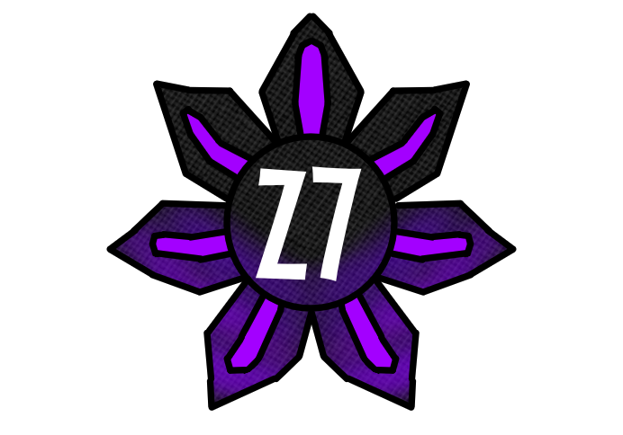

<div align="center">
  
  <h1 style="font-size: 2.5rem; margin-top: 0.5rem;">Z7 Project</h1>
</div>

Z7 is an in-dev Blaze server emulator for Plants vs Zombies: Garden Warfare 2 which allows for offline play of the story mode with local save files. It is made up of 5 individual servers:

- Blaze server - The core game server that handles authentication, loading save data and configs, and matchmaking.
- QoS server - Used to measure your ping and connection speeds to different datacenter locations to find the best one
- Bytevault server - Stores and handles all of your player save data
- Editorial server - Serves static assets and configs
- Redirector server - The initial connection which connects your game to an active Blaze server


## Installation

Before running the emulator, you must add the following entry to your hosts file so the game uses the emulator instead of the real EA servers. Run notepad as administrator and open C:\Windows\System32\drivers\etc\hosts and add the following line to the bottom of the file:

```
127.0.0.1 winter15.gosredirector.ea.com
```
Download and extract the release zip file. All you need to do to run the emulator is run Z7Launcher.exe and enter select your game's unpatched GW2.Main_Win64_Retail.exe. It will automatically patch the game and start the game with the private server. After the first launch setup, Z7Launcher will used the saved paths and start everything automatically


## Contact me
Discord: **khysnik**, you can find me in the PvZ FB Modding server.

Email: duckie98@protonmail.com

## Credits

- [BlazeSDK](https://github.com/Aim4kill/BlazeSDK) By [@Aim4kill](https://github.com/Aim4kill)
- [ME3PSE](https://github.com/PrivateServerEmulator/ME3PSE) By [@WarrantyVoider](https://github.com/zeroKilo) [@Erik-JS](https://github.com/Erik-JS)
- [BFP4FToolsWV](https://github.com/zeroKilo/BFP4FToolsWV) & [BFP4FToolsWV Wiki](https://github.com/zeroKilo/BFP4FToolsWV/wiki) By [@WarrantyVoider](https://github.com/zeroKilo)
- [PocketRelay](https://github.com/PocketRelay) & [jacobtread/tdf](https://github.com/jacobtread/tdf) By [@jacobtread](https://github.com/jacobtread/)
- [Hall of Meat](https://github.com/hallofmeat) By [@Hall of Meat Team](https://github.com/hallofmeat)
- [BlazeServer](https://github.com/pedromartins1/BlazeServer) By [@Perdo Martins](https://github.com/pedromartins1)
- [BlazeSharkExtended](https://github.com/Tratos/BlazeSharkExtended) By [@Tratos](https://github.com/Tratos)
- [recap_server](https://github.com/vitor251093/recap_server) By [@vitor251093](https://github.com/vitor251093) and [@dalkon](https://github.com/dalkon)
- [openBlase](https://github.com/openBlase/openBlase) By [@openBlase](https://github.com/openBlase/openBlase)
- [BF4BlazeEmulator](https://github.com/buchacho/BF4BlazeEmulator) By [@buchacho](https://github.com/buchacho)
- [@the1Domo](https://github.com/g91)
- [open-ds2-server](https://github.com/lowlevelmetal/open-ds2-server) By [@lowlevelmetal](https://github.com/lowlevelmetal)
- [RaGEZONE Forums](https://forum.ragezone.com/)
- [@BreakfastBrainz2](https://github.com/breakfastbrainz2)
